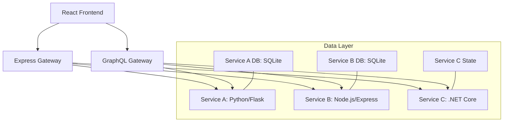

# Technical Implementation Requirements Document: Multi-Service Web Application (v3)

## System Architecture Implementation

### Current Service Architecture


### Service-Specific Implementation Details

#### 1. Service A (User Management)
```typescript
// Current Database Schema
interface User {
  id: number;
  username: string;
  email: string;
  password: string; // Hashed
  createdAt: Date;
  updatedAt: Date;
}

// Authentication Flow
type AuthResponse = {
  token: string;
  user: Omit<User, 'password'>;
};
```

**Key Components:**
- Flask-SQLAlchemy for ORM
- Flask-Migrate for schema management
- Password hashing with Werkzeug
- Session management with Flask-Session
- CORS handling with Flask-CORS

#### 2. Service B (Post Management)
```typescript
// Current Schema
interface Post {
  id: number;
  title: string;
  content: string;
  authorId: number;
  createdAt: Date;
  updatedAt: Date;
}

// Drizzle Schema Implementation
export const posts = sqliteTable('posts', {
  id: integer('id').primaryKey(),
  title: text('title').notNull(),
  content: text('content').notNull(),
  authorId: integer('authorId').notNull(),
  createdAt: text('created_at').notNull(),
  updatedAt: text('updated_at').notNull()
});
```

**Key Components:**
- Drizzle ORM for database operations
- Type-safe schema definitions
- Relationship handling with Service A

#### 3. Service C (Calculator)
```csharp
// Current Implementation
public class CalculationResult
{
    public double Number1 { get; set; }
    public double Number2 { get; set; }
    public double Sum { get; set; }
    public double RandomNumber { get; set; }
    public DateTime Timestamp { get; set; }
}

public interface ICalculatorService
{
    Task<CalculationResult> Calculate(double n1, double n2);
}
```

**Key Components:**
- Clean architecture implementation
- Dependency injection
- Interface-based service layer
- Error handling middleware

### Inter-Service Communication Patterns

#### 1. Authentication Flow
```typescript
// Internal API Authentication
interface InternalAPIConfig {
  headers: {
    'X-Internal-API-Key': string;
    'X-Service-Name': string;
  };
}

// Service-to-Service Communication
async function verifyUserInternally(userId: number): Promise<boolean> {
  const response = await fetch(
    `${SERVICE_A_URL}/internal/verify/${userId}`,
    internalAPIConfig
  );
  return response.ok;
}
```

#### 2. Error Handling Implementation
```typescript
// Standardized Error Response
interface ErrorResponse {
  error: string;
  code: string;
  service: string;
  timestamp: string;
}

// Error Middleware
const errorHandler = (err: Error, req: Request, res: Response) => {
  logger.error({
    error: err.message,
    stack: err.stack,
    service: process.env.SERVICE_NAME
  });
  
  res.status(500).json({
    error: err.message,
    code: 'INTERNAL_ERROR',
    service: process.env.SERVICE_NAME,
    timestamp: new Date().toISOString()
  });
};
```

### Current Monitoring Implementation

#### 1. Logging Strategy
```typescript
// Structured Logging Implementation
const logger = winston.createLogger({
  format: winston.format.combine(
    winston.format.timestamp(),
    winston.format.json()
  ),
  defaultMeta: { service: process.env.SERVICE_NAME },
  transports: [
    new winston.transports.Console(),
    new winston.transports.File({ filename: 'error.log', level: 'error' }),
    new winston.transports.File({ filename: 'combined.log' })
  ]
});
```

#### 2. Health Check Implementation
```typescript
// Health Check Endpoint
app.get('/health', async (req, res) => {
  try {
    const dbHealth = await checkDatabaseConnection();
    const serviceHealth = await checkServiceDependencies();
    
    res.json({
      status: 'healthy',
      database: dbHealth,
      dependencies: serviceHealth,
      uptime: process.uptime(),
      memory: process.memoryUsage()
    });
  } catch (error) {
    res.status(503).json({
      status: 'unhealthy',
      error: error.message
    });
  }
});
```

### Database Implementation Details

#### 1. Service A Schema
```sql
-- Current Schema Implementation
CREATE TABLE users (
    id INTEGER PRIMARY KEY AUTOINCREMENT,
    username TEXT NOT NULL UNIQUE,
    email TEXT NOT NULL UNIQUE,
    password_hash TEXT NOT NULL,
    created_at TIMESTAMP DEFAULT CURRENT_TIMESTAMP,
    updated_at TIMESTAMP DEFAULT CURRENT_TIMESTAMP
);

-- Indexes
CREATE INDEX idx_users_email ON users(email);
CREATE INDEX idx_users_username ON users(username);
```

#### 2. Service B Schema
```sql
-- Current Schema Implementation
CREATE TABLE posts (
    id INTEGER PRIMARY KEY AUTOINCREMENT,
    title TEXT NOT NULL,
    content TEXT NOT NULL,
    author_id INTEGER NOT NULL,
    created_at TIMESTAMP DEFAULT CURRENT_TIMESTAMP,
    updated_at TIMESTAMP DEFAULT CURRENT_TIMESTAMP,
    FOREIGN KEY (author_id) REFERENCES users(id)
);

-- Indexes
CREATE INDEX idx_posts_author ON posts(author_id);
CREATE INDEX idx_posts_created ON posts(created_at DESC);
```

### Frontend Implementation Details

#### 1. State Management Patterns
```typescript
// React Query Implementation
const useUsers = () => {
  return useQuery({
    queryKey: ['/api/users'],
    queryFn: async () => {
      const response = await fetch('/api/users');
      if (!response.ok) {
        throw new Error('Failed to fetch users');
      }
      return response.json();
    }
  });
};

// Form State Management
const UserForm = () => {
  const form = useForm<UserFormData>({
    resolver: zodResolver(userSchema),
    defaultValues: {
      username: '',
      email: '',
      password: ''
    }
  });
  
  // Form submission handling
  const onSubmit = async (data: UserFormData) => {
    try {
      await createUser.mutate(data);
      toast({
        title: 'Success',
        description: 'User created successfully'
      });
    } catch (error) {
      toast({
        title: 'Error',
        description: error.message,
        variant: 'destructive'
      });
    }
  };
};
```

### Security Implementation

#### 1. Authentication Implementation
```typescript
// Password Hashing (Service A)
def hash_password(password: str) -> str:
    return generate_password_hash(password)

def verify_password(stored_hash: str, password: str) -> bool:
    return check_password_hash(stored_hash, password)

// Session Management
app.use(
  session({
    store: new MemoryStore({
      checkPeriod: 86400000 // prune expired entries every 24h
    }),
    secret: process.env.SESSION_SECRET,
    resave: false,
    saveUninitialized: false,
    cookie: {
      secure: process.env.NODE_ENV === 'production',
      httpOnly: true,
      maxAge: 24 * 60 * 60 * 1000 // 24 hours
    }
  })
);
```

#### 2. API Security Implementation
```typescript
// CORS Configuration
const corsOptions = {
  origin: process.env.FRONTEND_URL,
  credentials: true,
  methods: ['GET', 'POST', 'PUT', 'DELETE'],
  allowedHeaders: ['Content-Type', 'Authorization']
};

app.use(cors(corsOptions));

// Rate Limiting
const limiter = rateLimit({
  windowMs: 15 * 60 * 1000, // 15 minutes
  max: 100 // limit each IP to 100 requests per windowMs
});

app.use(limiter);
```

### Testing Implementation

#### 1. Unit Test Examples
```typescript
// Service A Tests (Python/pytest)
def test_user_creation():
    user_data = {
        'username': 'testuser',
        'email': 'test@example.com',
        'password': 'securepass'
    }
    response = client.post('/api/users', json=user_data)
    assert response.status_code == 201
    assert 'id' in response.json

// Service B Tests (Jest)
describe('Post Creation', () => {
  it('should create a new post', async () => {
    const postData = {
      title: 'Test Post',
      content: 'Test Content',
      authorId: 1
    };
    const response = await request(app)
      .post('/api/posts')
      .send(postData);
    expect(response.status).toBe(201);
    expect(response.body).toHaveProperty('id');
  });
});
```

#### 2. Integration Test Examples
```typescript
// Cross-Service Integration Tests
describe('Post Creation with User Verification', () => {
  it('should verify user before creating post', async () => {
    // Mock Service A response
    mockServiceA.get('/internal/verify/1').reply(200, { valid: true });
    
    const response = await request(app)
      .post('/api/posts')
      .send({
        title: 'Test',
        content: 'Content',
        authorId: 1
      });
    
    expect(response.status).toBe(201);
  });
});
```

### Deployment Configuration

#### 1. Environment Variables
```typescript
// Required Environment Variables
interface EnvironmentConfig {
  // Database
  DATABASE_URL: string;
  
  // Security
  SESSION_SECRET: string;
  INTERNAL_API_KEY: string;
  
  // Service URLs
  SERVICE_A_URL: string;
  SERVICE_B_URL: string;
  SERVICE_C_URL: string;
  
  // Monitoring
  LOG_LEVEL: 'debug' | 'info' | 'warn' | 'error';
  SENTRY_DSN?: string;
  
  // Frontend
  VITE_API_URL: string;
}
```

#### 2. Service Dependencies
```json
{
  "dependencies": {
    // Frontend
    "@tanstack/react-query": "^4.0.0",
    "wouter": "^2.0.0",
    "@hookform/resolvers": "^3.0.0",
    
    // Backend
    "express": "^4.0.0",
    "cors": "^2.0.0",
    "winston": "^3.0.0",
    
    // Database
    "drizzle-orm": "^0.28.0",
    "better-sqlite3": "^8.0.0",
    
    // Testing
    "jest": "^29.0.0",
    "ts-jest": "^29.0.0"
  }
}
```

### Performance Monitoring Implementation

#### 1. Metrics Collection
```typescript
// Response Time Monitoring
app.use((req, res, next) => {
  const start = process.hrtime();
  
  res.on('finish', () => {
    const [seconds, nanoseconds] = process.hrtime(start);
    const duration = seconds * 1000 + nanoseconds / 1000000;
    
    logger.info({
      type: 'request',
      method: req.method,
      path: req.path,
      status: res.statusCode,
      duration: duration.toFixed(2)
    });
  });
  
  next();
});
```

#### 2. Resource Monitoring
```typescript
// Memory Usage Monitoring
setInterval(() => {
  const usage = process.memoryUsage();
  
  logger.info({
    type: 'memory',
    heapTotal: usage.heapTotal / 1024 / 1024,
    heapUsed: usage.heapUsed / 1024 / 1024,
    external: usage.external / 1024 / 1024,
    rss: usage.rss / 1024 / 1024
  });
}, 60000); // Every minute
```

### Error Handling Implementation

#### 1. Global Error Handler
```typescript
// Express Error Handler
app.use((err: Error, req: Request, res: Response, next: NextFunction) => {
  logger.error({
    error: err.message,
    stack: err.stack,
    path: req.path,
    method: req.method,
    requestId: req.id
  });
  
  // Send sanitized error to client
  res.status(500).json({
    error: 'Internal Server Error',
    requestId: req.id
  });
});
```

#### 2. Service-Specific Error Handling
```typescript
// Service A Error Handler (Python)
@app.errorhandler(Exception)
def handle_error(error):
    response = {
        'error': str(error),
        'service': 'service-a',
        'timestamp': datetime.utcnow().isoformat()
    }
    status_code = 500
    
    if isinstance(error, ValidationError):
        status_code = 400
    elif isinstance(error, NotFound):
        status_code = 404
    
    return jsonify(response), status_code
```

## Implementation Guidelines

### Code Organization
1. **Frontend Structure**
```
client/
  ├── src/
  │   ├── components/      # Reusable UI components
  │   ├── hooks/          # Custom React hooks
  │   ├── pages/          # Page components
  │   ├── lib/            # Utilities and helpers
  │   └── App.tsx         # Main application component
```

2. **Backend Structure**
```
services/
  ├── service-a/          # Python/Flask service
  │   ├── models/         # Database models
  │   ├── routes/         # API routes
  │   └── tests/          # Service tests
  ├── service-b/          # Node.js service
  │   ├── src/            # Source code
  │   └── tests/          # Service tests
  └── service-c/          # .NET service
      ├── Controllers/    # API controllers
      └── Services/       # Business logic
```

### Development Workflow
1. **Local Development**
   - Run services independently
   - Use SQLite for development
   - Enable debug logging
   - Run tests before commits

2. **Code Review Process**
   - Verify test coverage
   - Check logging implementation
   - Review error handling
   - Validate API contracts

### Monitoring and Debugging
1. **Local Debugging**
   - Service logs in `combined.log`
   - Error logs in `error.log`
   - Database query logs
   - API request/response logs

2. **Production Monitoring**
   - Centralized logging
   - Performance metrics
   - Error tracking
   - Resource utilization

## Implementation Constraints

### Current Limitations
1. **SQLite Constraints**
   - No concurrent writes
   - Limited scalability
   - No built-in replication

2. **Service Communication**
   - Direct HTTP calls
   - No message queue
   - Synchronous operations

### Future Considerations
1. **Potential Improvements**
   - PostgreSQL migration
   - Message queue integration
   - Caching layer
   - Service mesh

2. **Scaling Considerations**
   - Database sharding
   - Load balancing
   - Service replication
   - Cache distribution
