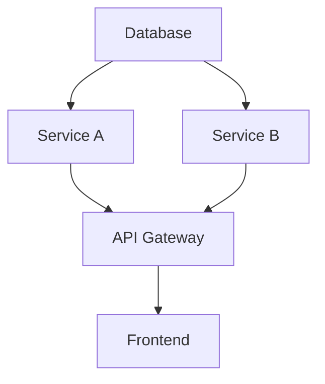

# Multi-Service Application Technical Architecture

## System Architecture Deep Dive

### Service Architecture Overview
```
┌─────────────────┐     ┌──────────────────┐     ┌─────────────────┐
│  React Frontend │     │  Express Gateway  │     │ GraphQL Gateway │
└────────┬────────┘     └────────┬─────────┘     └────────┬────────┘
         │                       │                         │
         └───────────────────────┼─────────────────────────┘
                                │
         ┌──────────┬───────────┼────────────┬──────────┐
         │          │           │            │          │
   ┌─────▼────┐  ┌─▼────┐  ┌───▼───┐   ┌───▼───┐  ┌───▼────┐
   │Service A │  │Service│  │Service│   │Service│  │Service │
   │(Python)  │  │  B   │  │   C   │   │GraphQL│  │Gateway │
   └──────────┘  │(Node) │  │(.NET) │   │(Node) │  │(Node)  │
                 └───────┘  └───────┘   └───────┘  └────────┘
```

### Critical Components
#### 1. Express Gateway (server/routes.ts)
- **Role**: Central API gateway and request router
- **Key Responsibilities**:
  - Route requests to appropriate microservices
  - Handle service-to-service authentication
  - Error handling and response normalization
  - CORS and security middleware
- **Security Critical Points**:
  - Internal API key validation (`INTERNAL_API_KEY`)
  - Request header sanitization
  - Error message sanitization
  - Token validation for cross-service calls

#### 2. Service A (Python Flask)
- **Purpose**: User Management Service
- **Core Features**:
  - User CRUD operations
  - Authentication endpoints
  - Internal user verification
- **Data Layer**:
  - SQLite with Flask-SQLAlchemy
  - Migration management via Flask-Migrate
- **Critical Security Points**:
  - Password hashing and validation
  - Session management
  - Internal API authentication

#### 3. Service B (TypeScript/Node.js)
- **Purpose**: Post Management Service
- **Core Features**:
  - Post CRUD operations
  - User-post relationship management
  - Post verification endpoints
- **Data Layer**:
  - SQLite with Drizzle ORM
  - Schema management via Drizzle Kit
- **Critical Security Points**:
  - Post ownership validation
  - Cross-service user validation
  - Request validation

#### 4. Service C (.NET Core)
- **Purpose**: Calculator Service
- **Core Features**:
  - Mathematical operations
  - Timestamp tracking
  - Random number generation
- **Architecture**:
  - Clean architecture pattern
  - Business logic isolation
  - Swagger/OpenAPI documentation

#### 5. GraphQL Gateway
- **Purpose**: Unified API Layer
- **Implementation**:
  - Apollo Server Express
  - Type-safe resolvers
  - Service client abstraction
- **Critical Features**:
  - Query batching and optimization
  - Error handling and formatting
  - Schema stitching

### GraphQL Schema Architecture:
- Type definitions for services A and B
- Query and Mutation segregation
- Input type validations

### Resolver Implementation:
- Service client abstractions
- Error handling in resolvers
- Cross-service data fetching


### Inter-Service Communication

#### Authentication Flow
```
┌──────────┐    ┌────────┐    ┌──────────┐
│ Service B│    │Gateway │    │Service A │
└────┬─────┘    └───┬────┘    └────┬─────┘
     │  Request     │              │
     │──────────────►              │
     │              │ Verify User  │
     │              │─────────────►│
     │              │              │
     │              │ User Valid   │
     │              │◄─────────────│
     │   Response   │              │
     │◄─────────────│              │
     │              │              │
```

#### Key Integration Points
1. User Verification (Service A ↔ Gateway)
   ```typescript
   // Critical code in server/routes.ts
   app.get("/api/verify/user/:userId", async (req, res) => {
     // Internal API authentication required
     headers: { "X-Internal-API-Key": INTERNAL_API_KEY }
   });
   ```

2. Post Creation (Service B ↔ Gateway ↔ Service A)
   ```typescript
   // Verify user before post creation
   const userValid = await verifyUser(authorId);
   if (!userValid) throw new Error("Invalid user");
   ```

### Security Architecture

#### 1. Authentication Layers
- **External API Security**:
  - Session-based authentication
  - CORS configuration
  - Rate limiting

- **Internal API Security**:
  - Internal API key validation
  - Service-to-service authentication
  - Request source validation

#### 2. Data Security
- **Database Security**:
  - Parameterized queries
  - Input validation
  - Schema validation

- **Communication Security**:
  - Internal network isolation
  - Encrypted communication
  - Request/Response validation

### Operability Dimensions

#### 1. Monitoring Points
- Service health endpoints
- Error rate tracking
- Response time monitoring
- Database connection status
- Inter-service communication latency

#### 2. Logging Strategy
```typescript
// Centralized logging in Express Gateway
app.use((req, res, next) => {
  const start = Date.now();
  res.on("finish", () => {
    const duration = Date.now() - start;
    log(`${req.method} ${path} ${res.statusCode} in ${duration}ms`);
  });
});
```

#### 3. Error Handling
- Standardized error responses
- Error categorization
- Cross-service error propagation
- User-friendly error messages

### State Management

#### 1. Frontend State
```typescript
// React Query Pattern for API Integration
const { data, isLoading, error } = useQuery<CalculationResult>({
  queryKey: ['calculator', number1, number2],
  queryFn: async () => {
    const response = await axios.get(`/api/calculator/add/${number1}/${number2}`);
    return response.data;
  }
});

// Toast State Management
const TOAST_LIMIT = 1;
const TOAST_REMOVE_DELAY = 1000000;
type ToasterToast = ToastProps & {
  id: string;
  title?: React.ReactNode;
  description?: React.ReactNode;
  action?: ToastActionElement;
};
```

- React Query for server state
  - Automatic cache invalidation
  - Error handling patterns
  - Loading state management
  - Query key structure for cache control
- Local state management
  - Component-level useState
  - Context-based shared state
  - Mobile responsive state hooks
- Form state with react-hook-form
  - Zod schema validation
  - Error handling and display
  - Field-level validation
- Cache invalidation strategy
  - Query invalidation patterns
  - Optimistic updates
  - Background refetching

#### 2. Backend State
- Database persistence
  - SQLite with Drizzle ORM (Service B)
  - Flask-SQLAlchemy (Service A)
  - Entity relationships
- Session management
  - Express session middleware
  - Passport authentication
  - Session store configuration
- Cache management
  - Query result caching
  - Session data caching
  - API response caching
- State synchronization
  - Cross-service data consistency
  - Event-based updates
  - Real-time data propagation

### Testing Architecture

#### 1. Service A (Python)
- Unit tests with pytest
- Integration tests
- API endpoint testing
- Database testing

#### 2. Service B (TypeScript)
- Jest for unit testing
- Integration testing
- API testing
- Mock service responses

#### 3. Service C (.NET)
- xUnit test framework
- Integration tests
- Controller testing
- Business logic testing

### Critical Dependencies
```json
{
  "Frontend": {
    "react-query": "State management",
    "wouter": "Routing",
    "shadcn/ui": "UI components"
  },
  "Backend": {
    "express": "API Gateway",
    "flask": "Service A",
    "dotnet": "Service C"
  },
  "Database": {
    "sqlite": "Data storage",
    "drizzle": "ORM (Service B)",
    "sqlalchemy": "ORM (Service A)"
  }
}
```

### Deployment Architecture

#### 1. Service Configuration
- Environment variables
- Service discovery
- Port management
- Database connections

#### 2. Startup Dependencies


### Security Considerations

#### 1. API Security
- Rate limiting implementation
- Input validation
- Authentication tokens
- CORS policies

#### 2. Data Security
- Database access control
- Data encryption
- Secure communication
- Error handling

### Development Guidelines

#### 1. Code Organization
- Service separation
- Clean architecture
- Dependency management
- Type safety

#### 2. Best Practices
- Error handling patterns
- Logging standards
- Testing requirements
- Documentation requirements

### Known Limitations and Trade-offs

1. **Performance**
   - SQLite limitations
   - Service communication overhead
   - GraphQL N+1 queries

2. **Scalability**
   - Single gateway bottleneck
   - Database scalability
   - Service dependencies

3. **Maintenance**
   - Multiple technology stacks
   - Cross-service debugging
   - Schema synchronization

### Future Considerations

1. **Improvements**
   - Caching layer
   - Message queues
   - Service mesh
   - Monitoring systems

2. **Scalability**
   - Database sharding
   - Load balancing
   - Service replication

### Handoff Requirements

1. **Development Environment**
   - Node.js setup
   - Python environment
   - .NET SDK
   - Database tools

2. **Documentation**
   - API documentation
   - Database schemas
   - Service interfaces
   - Deployment guides

3. **Access Requirements**
   - API keys
   - Database credentials
   - Service endpoints
   - Development tools